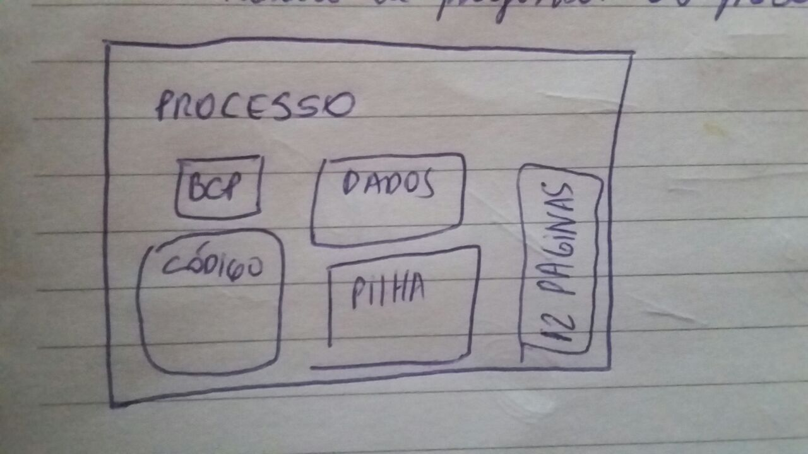
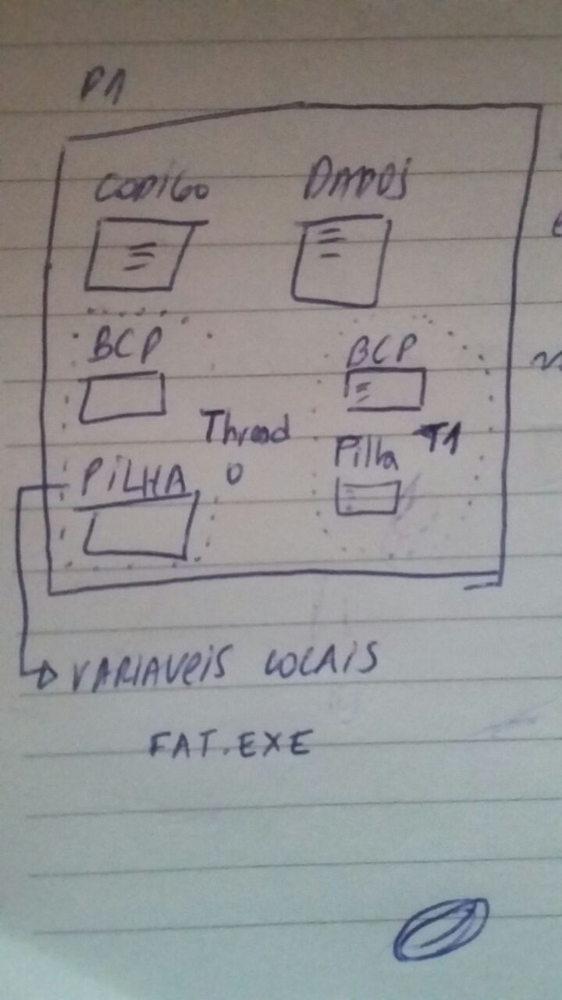

# Processos

Processo possui estado
  - arto (???)
  - em execução
  - bloqueado
  - etc

### PCB (bloco de controle de processo)
Tem um contexto no qual o processo esta executando, estado do registrador, tabelas de paginas do processo...

Algo como:

S.O. demora para executar o código de fato do processo. Assim era chamado os processos **pesados**.

Para resolver este problema foram criados os processos **leves**, ou **threads**.

Criar uma thread nova é criar uma cópia do BCP e da pilha. Ou seja, não precisa ir no disco..

### Escalonamento

Preemptivo:
- Processo perde CPU sem aviso prévio.

Não preemptivo: 
- Processo toma CPU e só devolve quando quer.
- Colaborativo
- CPU só retoma quando processo faz i/o, invoca chamada de sistema, page fault.

Hardware interrompe processo e devolve p/ o processador.

## Escalonamentos não preemptivos:
#### FCFS
> Primeiro que chega ganha a CPU.

#### SJF
> Short job first, ou seja, menor processo vai primeiro. Mas o que é menor? Há! Quantos ciclos de necessidade tem.

## Preemptivo
Só com ajuda do hardware. Tem um timer (relógio) que quando se esgota, devolve a CPU. 

